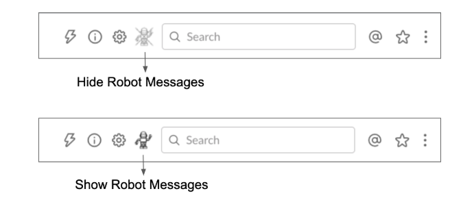

# Slack Robot Manager

An extension for Chrome that shows/hides messages from Slack robots.

The current list of supported robots can be found in [robots.js](slack-robot-manager/robots.js).

## Local Installation

1. Run `git clone https://github.com/laffra/srm.git`
2. Open `chrome://extensions` in Chrome
3. Enable `Developer mode`
4. Select `Load unpacked` and choose `~/srm/slack-robot-manager`
5. Reload your `app.slack.com` browser windows

## Usage

This extension adds an extra button to each channel with which you can either hide or show messages from robots.

## Customization

The current list of supported robots can be found in [robots.js](robots.js). To modify the list of robots (this works only if you have a locally installed copy of the extension):

1. Edit `robots.js`
2. Go to `chrome://extensions` and reload the unpacked extension
3. Reload your `app.slack.com` browser windows
4. Create a github pull request to share your robot definitions
